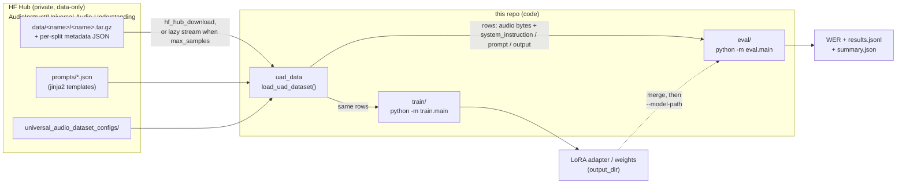

# universal_audio_instruct

Tooling for the **Universal Audio Understanding** audio-instruction benchmark:
loading the dataset, evaluating models on it, and (in progress) finetuning models
against it.

The dataset itself lives in a separate, private HuggingFace repo
([`AudioInstruct/Universal-Audio-Understanding`](https://huggingface.co/datasets/AudioInstruct/Universal-Audio-Understanding))
— this repo is the code. The dataset is loaded as plain data via `huggingface_hub`
(no `trust_remote_code` loading script); see [`MIGRATION.md`](./MIGRATION.md).

## Layout

```
uad_data/     # shared dataset library: load_uad_dataset() downloads + expands rows
eval/         # evaluation harness (batched inference + metrics)   -> python -m eval.main
train/        # QLoRA finetuning via HF Trainer                     -> python -m train.main
configs/      # dataset run configs (which datasets/tasks/splits)   e.g. clotho_config.json
tests/        # offline tests
```

Both `eval/` and `train/` consume the same `uad_data` loader, so evaluation and
training see identical rows.

## How it fits together



No code is downloaded or executed from the Hub (`trust_remote_code` is gone);
`uad_data` fetches only plain data files and expands each audio clip into
`(task × prompt-template)` rows locally. `asr_timestamp_search` also expands per
utterance: `(task × utterance × prompt-template)`.

## Quickstart (evaluation)

```bash
pip install -r requirements.txt
export HF_TOKEN=...            # dataset + gated models are private
python -m eval.main --model GEMMA-4 --json-config configs/clotho_config.json --split test
```

Or use the Colab notebook: [`eval/colab_eval.ipynb`](./eval/colab_eval.ipynb).

## Loading the dataset directly

```python
from uad_data import load_uad_dataset

rows = load_uad_dataset(
    json_config_path="configs/clotho_config.json",   # local path or a name under the repo's universal_audio_dataset_configs/
    split="test",             # or "validation+test", or "all" (every split the config lists)
    repo_id="AudioInstruct/Universal-Audio-Understanding",
    token="hf_...",           # private dataset
    clips_per_split=None,     # take only the first N clips of each split; stops reading early
    seed=42,                  # fixes each row's pick when the config randomizes templates
    # stream=None,            # lazily stream archives (auto-on when clips_per_split is set)
    #                         # so a small cap downloads only the archive prefix, not the whole tar
)
# each row: audio ({"path", "bytes"}), audio_path, system_instruction, prompt, output,
# task, originating_dataset, split, plus every field of the clip's metadata record
# and a `tasks` list
```

## Finetuning

```bash
pip install -r requirements.txt -r train/requirements.txt
python -m train.main --model GEMMA-4 --json-config configs/clotho_config.json --split train
```

HF `Trainer`-based, one training backend per model (Gemma, Qwen3-Omni)
mirroring the eval backends. Three modes: QLoRA (default), LoRA on a bf16 base
(`--no-4bit`), full finetune (`--no-4bit --no-lora`). **Full guide:
[`FINETUNING.md`](./FINETUNING.md).**

## Onboarding a new internal dataset

An *internal dataset* is one source corpus inside the benchmark (Clotho, VIVOS,
URDU, …). Adding one touches both repos: the audio, metadata and prompt templates
go to the HF dataset repo, and the registry entry that lets `uad_data` find them
goes here. The data format and upload steps are documented on the dataset card:
**[Onboarding a new internal dataset (HF)](https://huggingface.co/datasets/AudioInstruct/Universal-Audio-Understanding#onboarding-a-new-internal-dataset)**.

For a dataset called `MyDataset`:

1. **Choose its tasks.** Each task must be a `Task` in
   [`uad_data/tasks.py`](./uad_data/tasks.py) *and* have a `prompts/<task>.json`
   on the Hub. `Task.features` lists the metadata fields that task reads (e.g.
   `classification` needs `category` and `categories`; `asr` needs
   `transcription`), so name your metadata fields to match. If you need a new
   task, add an enum value and its `features` entry here, and upload a matching
   prompt file to the Hub.
2. **Upload the data to the HF repo**, following the dataset card:
   `data/MyDataset/MyDataset.tar.gz` plus one `data/MyDataset/MyDataset_<split>.json`
   per split. Each `audio_path` in the metadata must match an archive member path
   exactly, and each record must include every field from step 1.
3. **Register it** in [`uad_data/internal_datasets.py`](./uad_data/internal_datasets.py),
   keeping `DATASETS` in case-insensitive alphabetical order:

   ```python
   InternalDataset(
       name='MyDataset',   # must match the folder name under data/ exactly (case-sensitive)
       description='What it is, in a sentence or two.\nhttps://link-to-source',
       tasks=[Task.CLASSIFICATION, Task.ASR],
       splits=[datasets.Split.TRAIN, datasets.Split.TEST],   # only splits that have a metadata JSON
       data_url='data/MyDataset/MyDataset.tar.gz',
   ),
   ```

   `tasks` and `splits` list everything the dataset supports. A run config can
   only request a subset of them.
4. **Add a run config** such as `configs/mydataset_config.json`, in the same
   shape as [`configs/clotho_config.json`](./configs/clotho_config.json). `tasks`
   is required. If you leave out `splits`, the config uses every registered
   split. To let others load the config by name, also upload it to the Hub's
   `universal_audio_dataset_configs/`.
5. **Test it**, then commit the registry entry and config. The offline tests
   don't read your data, but they import the registry, so they catch syntax
   errors in it. The smoke test runs against the Hub,
   and `--max-samples` makes it stream the archive and stop early, so it
   downloads only the first part of the archive:

   ```bash
   python -m pytest tests
   python -m eval.main --model GEMMA-4 --json-config configs/mydataset_config.json --split test --max-samples 5
   ```

   Note that the evaluator currently computes a single WER over all rows,
   whatever their task.

| Symptom | Likely cause |
| --- | --- |
| `Unsupported dataset: MyDataset` | Not registered in `DATASETS`, or the name's case differs |
| `Task: [...]` or `Splits: [...] requested of MyDataset, which only contains ...` | The config asks for a task or split that the registry entry doesn't declare |
| `No prompt file exists for Task.X` | The Hub has no `prompts/<task>.json` for that task |
| `KeyError` while rendering a row | A metadata record is missing a field that its task's `Task.features` requires |
| ``ValueError: asr_timestamp_search row for '…': `transcriptions` must be a non-empty list of utterances`` | An asr_timestamp_search record's `transcriptions` is missing, empty or not a list |
| Hub "entry not found" / 404 | The file isn't at `data/MyDataset/MyDataset_<split>.json` or at `data_url` |
| Loads 0 rows for the dataset | Archive member paths don't match `audio_path` (e.g. `./audio/x.wav` vs `audio/x.wav`) |

## Tests

```bash
python -m pytest tests    # offline; needs pytest, datasets, jinja2, huggingface_hub
```
