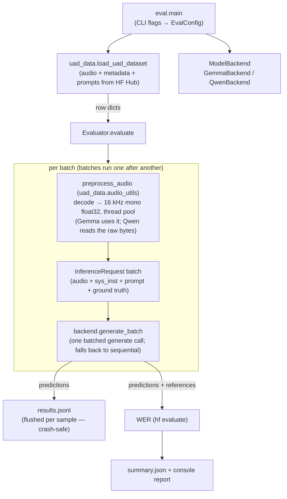

# eval — evaluation harness

Batched evaluation of audio-instruction models (Gemma, Qwen3-Omni) on the
Universal Audio Understanding dataset. Rows come from the shared
[`uad_data`](../uad_data) loader — the same rows [`train/`](../train) finetunes on.

```bash
pip install -r requirements.txt
export HF_TOKEN=...   # private dataset; some models are gated
python -m eval.main --model GEMMA-4 --json-config configs/clotho_config.json --split test
```

Or run on an A100 in Colab: [`colab_eval.ipynb`](./colab_eval.ipynb).

## Flow



## Pieces

| file | role |
| --- | --- |
| `main.py` | CLI entry point; wires config → loader → backend → evaluator |
| `config.py` | `EvalConfig` + `DEFAULT_MODEL_PATHS` (registry shared with `train/`) |
| `evaluator.py` | batch loop: threaded audio decoding, then one batched generate call per batch; incremental `results.jsonl`; one WER over all rows |
| `backends/base.py` | `ModelBackend` ABC + `InferenceRequest` |
| `backends/gemma.py` | Gemma: audio arrays in chat messages, batched `processor(text, audio)` |
| `backends/qwen.py` | Qwen3-Omni: raw audio bytes in temp files + `process_mm_info`, batched processing |

To evaluate a finetuned checkpoint, merge the LoRA adapter and pass it via
`--model-path` — see [`FINETUNING.md`](../FINETUNING.md#evaluating-a-finetuned-model).
