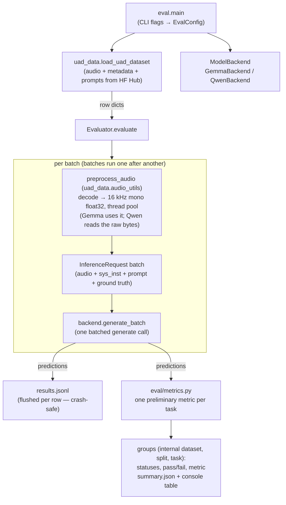

# eval — evaluation harness

Batched evaluation of audio-instruction models (Gemma, Qwen3-Omni) on the
Universal Audio Understanding dataset. Rows come from the shared
[`uad_data`](../uad_data) loader — the same rows [`train/`](../train) finetunes on.

```bash
pip install -r requirements.txt
export HF_TOKEN=...   # private dataset; some models are gated
python -m eval.main --model GEMMA-4 --json-config configs/clotho_config.json --split test
```

Or run on an A100 in Colab: [`colab_eval.ipynb`](./colab_eval.ipynb).

## Flow



## Pieces

| file | role |
| --- | --- |
| `main.py` | CLI entry point; wires config → loader → backend → evaluator, and turns a smoke run's result into its exit status |
| `config.py` | `EvalConfig` + `DEFAULT_MODEL_PATHS` (registry shared with `train/`) |
| `evaluator.py` | batch loop: threaded audio decoding, then one batched generate call per batch; incremental `results.jsonl`; a status for every row, then per-group pass/fail and metrics |
| `metrics.py` | the one preliminary metric each task reports, and the rule behind it; the module docstring holds the table |
| `backends/base.py` | `ModelBackend` ABC + `InferenceRequest` |
| `backends/gemma.py` | Gemma: audio arrays in chat messages, batched `processor(text, audio)` |
| `backends/qwen.py` | Qwen3-Omni: raw audio bytes in temp files + `process_mm_info`, batched processing |

## When a batch fails

Two layers catch a failing batch, and they predate each other:

- **Inside each backend**, `generate_batch` catches any exception and retries the
  batch one row at a time, printing one line. This was written before the
  evaluator had a policy of its own.
- **In `Evaluator._predict`**, a backend that raises, returns the wrong number of
  predictions, or returns anything other than text is one failure: the batch gets
  `model_error` in a smoke run, and a regular run re-raises.

Because the backend layer runs underneath, a genuine fault such as a CUDA OOM
currently becomes a silent 4×-slower run rather than a recorded `model_error`.
Collapsing the two into the evaluator's policy is an open improvement.

To evaluate a finetuned checkpoint, merge the LoRA adapter and pass it via
`--model-path` — see [`FINETUNING.md`](../FINETUNING.md#evaluating-a-finetuned-model).
